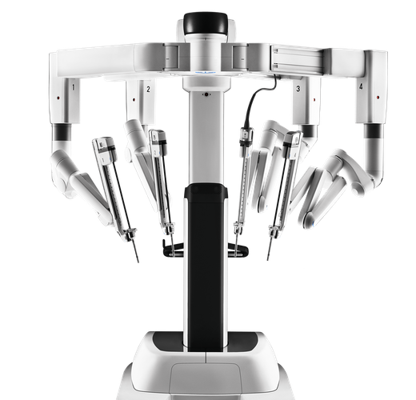
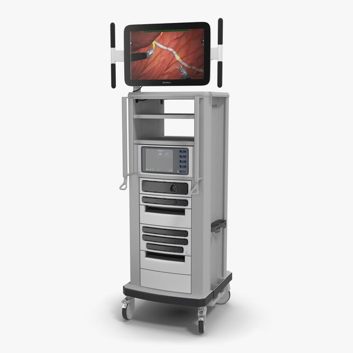

# Elevator Pitch
da Vinci Xi is a surgical robot that enables minimally invasive surgery. 
* Created a tool that would help surgeons identify cancerous tumors real time during surgery.
* Currently, surgeons rely on their experience to identify cancerous tissue during surgery. There is no functionality built into the surgical robot that would help surgeons identify tumors real time during surgery.
* There is no prepared dataset available for live surgery. I collected the images from online and prepare the dataset 
* The process is carried out in 2 stages. In the first global range detection is done using YOLOv4 and then in the second stage close range detection is done by VGG-16.
* Here is photo of the components of the robot.
        

This repository contains the google drive link for the dataset and code used for the paper "Enabling da Vinci Xi Robot with Live Tumor detection via Explainable Deep Learning"

# 1. Prepare
### Image dataset folder copy(classification) link**

This is the main folder that contatins all the images. In here, is a folder called "Partial robotic nephrectomy" which contains all the images with cancerous tissue. There is another folder called "Kidney" which contains all the images with non-cancerous tissue. The images were further cropped so that the robotic arms from the original images don't show up. The cancerous tissue images are in the folder called "Partial robotic nephrectomy cropped photos" and the non-cancerous tissues are in the folder called "Kidney cropped photos". The fatty tissues are in "Fat cropped photos". 

If you want to look at where the tumors are in the original images refer to "Label draft.pptx".

In "Partial robotic nephrectomy cropped photos" there are 44 images. 30 images were extracted into training set, 9 images were extracted into validation set, 5 images were extracted into test set. 

Now, Image augmentation was applied in the training set of Thesis data(1st) to make 1 image into 5 images. 

For the 2nd dataset, In "Thesis data (1st) fatty tissue" training data there were 21 images. 21 x 5 = 105. So, the first 21 images from the cancerous tissues, non cancerous tissue, fatty tissue were augemented to be 105 images in all cases. SO, there are 315 images for the training set in the 2nd dataset. 32 images for validation and 20 images for testing.

For the 3rd dataset, fatty tissue was not taken into account. From the 1st dataset there were 30 cancerous tissue and 40 non cancerous tissue for the training set. So, in order to keep the numbers equal, all the cancerous tissues were augmented but 30 out of 40 non cancerous tissues were augmented. That resulted in 150 training cancerous tissue and 150 training non cancerous tissue images.

# 2. Process / Share

A base model was evaluated in terms of how accurately the model was able to identify cancerous tissue from the images. From the base model the variable that were cahnged to assess the performances are-
1. Number of layers (Alexnet to VGG-16 to ResNet-50)
2. Learning rate
3. Layer depth

More information on this in the google colab links below. 

**VGG-16 1st dataset notebook link:** Contains the link to a google colab notebook for the 1st dataset model.

**VGG-16 2nd dataset notebook link:** Contains the link to a google colab notebook for the 2nd dataset model.

**VGG-16 3rd dataset notebook link:** Contains the link to a google colab notebook for the 3rd dataset model.

**VGG-16 2nd dataset saved model link:** The link contains the saved model used for the second dataset. The codes for saving the models are included in the notebook link "VGG-16 2nd dataset notebook link". This link is here as a backup. 

**VGG-16 3rd dataset saved model link:** The link contains the saved model used for the third dataset. The codes for saving the models are included in the notebook link VGG-16 3rd dataset notebook link. This link is here as a backup. 

# 3. Analysis

The cancer cell detection performance of the models were evaluated in 2 ways-
1. Visual evaluation
2. Metric evaluation

# 4. Act
The data collected for this analysis were from Macquarie University Hospital, Sydney, Australia and the data collected were only for Kidney cancer.So, the sample is not representative of the entire population. More data will have to be collected for the results to be more reliable in terms of the entire population. 
